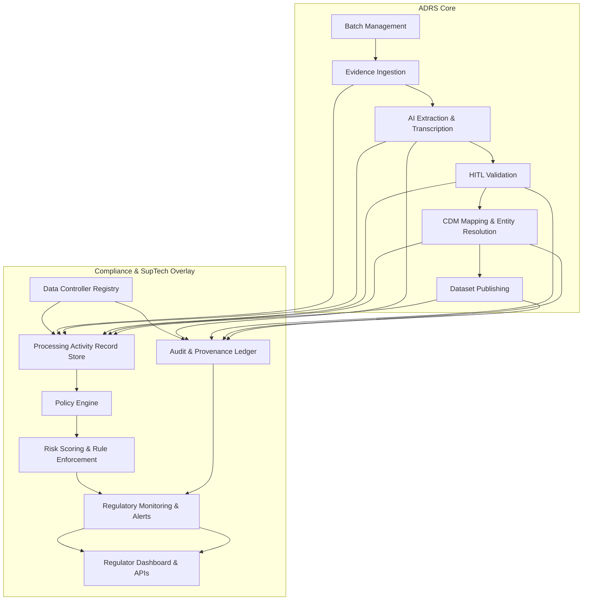
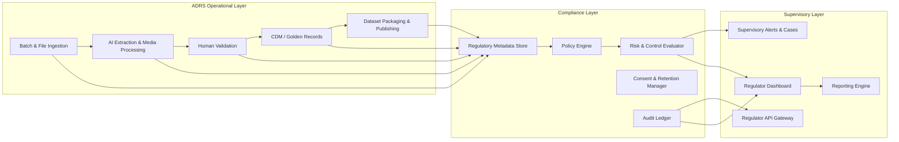

# ADRS + AI SupTech Integration Plan

## 1. Objective

Enable ADRS to function as a regulation-aware Data Readiness System under national and global data regimes. The goal is to make ADRS users accountable Data Controllers, with supervisory visibility for regulatory authorities.

---

## 2. Architecture Overview

### 2.1 High-Level Architecture

### 2.2 Architectural Components

- **ADRS Core Pipeline**
  - Batch registry and capacity enforcement
  - Evidence upload/import and file hashing
  - AI extraction and multimedia transcription
  - Human-in-the-loop validation and conflict resolution
  - CDM entity resolution and dataset publishing

- **Compliance Metadata Layer**
  - Add legal metadata to evidence, extraction, validation, CDM, and published dataset records
  - Track data categories, lawful basis, retention, sensitivity, and consent state

- **Policy & Enforcement Engine**
  - Policy-as-code engine for regulatory rules
  - Pre-publish gating and access controls
  - Dynamic enforcement for export, sharing, and retention

- **Accountability Registry**
  - Data Controller / Processor registry
  - Tenant roles extended to include DPO and Regulator identities
  - Processing activity records aligned to regulation requirements

- **Regulatory Supervision Services**
  - Continuous monitoring service for compliance violations
  - Regulator-facing APIs and dashboards
  - Incident and breach notification workflows

- **Audit & Provenance Ledger**
  - Immutable audit trail for process events
  - Signed event chains for regulator trust
  - Detailed provenance for AI classification and extraction decisions

### 2.3 Data Flow

1. A file enters ADRS through batch ingestion or source import.
2. The system stores processing metadata, including regulatory purpose and sensitivity.
3. AI extraction and validation produce data with provenance and risk labels.
4. Policy engine evaluates rules before dataset publishing or external access.
5. Audit ledger records decisions, overrides, and regulator views.
6. Regulatory dashboard exposes compliance state and supervisory reports.

---

## 3. Concrete Architecture Diagram

### 3.1 Logical Layer Diagram

### 3.2 Regulatory Data Control Plane

- **Tenant Registry:** Identity of Data Controller, Processor, DPO, and regulator roles
- **Processing Activity Records:** document and dataset level activity logs
- **Rule Enforcement:** guardrails for data sensitivity, export, and publication
- **Supervisory Reporting:** automatic filings and regulator inquiries

---

## 4. Prioritized Feature Backlog

### Phase 0: Foundation

1. **Add Compliance Metadata to Core Models**
   - Evidence files
   - Extraction runs
   - Validation tasks
   - CDM entity records
   - Published datasets

2. **Extend RBAC and Roles**
   - Add `REGULATOR`, `DATA_PROTECTION_OFFICER`, `DATA_CONTROLLER`
   - Expand role permissions in route guards and UI capabilities

3. **Data Controller Registry**
   - Build a registry UI/API for controller and processor profiles
   - Store jurisdiction, legal purpose, and contact information

4. **Processing Activity Record Store**
   - Log processing activity by evidence/file/dataset
   - Capture purpose, lawful basis, data categories, retention state

5. **Audit Log Enhancement**
   - Extend current audit model to include compliance event types
   - Add event categories: `POLICY_ENFORCEMENT`, `REGULATOR_ACCESS`, `DPIA`, `BREACH_REPORT`

### Phase 1: Enforcement + Monitoring

6. **Policy Engine MVP**
   - Create an evaluation engine for rules like lawful basis, sensitivity, publication block
   - Implement pre-publish validation gates

7. **Compliance Dashboard for ADRS Admins**
   - Show compliance health score, policy violations, and high-risk items
   - Surface regulatory readiness metrics like `processing_activities`, `retention_violations`, `high_sensitivity_extractions`

8. **Regulator API and Read-Only Endpoints**
   - `GET /api/regulator/activities`
   - `GET /api/regulator/audit-logs`
   - `GET /api/regulator/compliance-status`
   - `GET /api/regulator/processing-records`

9. **Supervisory Alerts Workflow**
   - Detect anomalies in file ingestion and publishing
   - Create supervisor cases for suspected noncompliance
   - Send alerts for rule violations and expired retention obligations

10. **Consent & Retention Management**
    - Add retention metadata to evidence and dataset records
    - Automatically flag expired or unsanctioned retention

### Phase 2: AI Trust & Explainability

11. **Provenance Capture for AI Decisions**
    - Link extraction output to prompt version, model, and confidence
    - Store why a particular entity was classified or resolved

12. **Explainability Reports**
    - Generate simple explainability summaries for extraction / classification events
    - Enable review of AI decisions within validation tasks

13. **Risk Scoring & Policy Violation Heatmaps**
    - Compute risk score per evidence file and dataset
    - Surface heatmaps for high-risk jurisdictions, data types, and processes

14. **Regulator-Facing Supervisory Dashboard**
    - Visualize compliance status, audit timeline, and active investigations
    - Show regulation-specific metrics such as GDPR processing inventory or POPIA purpose mappings

15. **AI Governance Metadata**
    - Capture model version, prompt template, policy evaluation results, and provenance with every AI service call

### Phase 3: SupTech Convergence

16. **External Authority Connectors**
    - Build export/reporting connectors for national regulators and cross-border supervisory systems
    - Support structured reporting, audit packs, and on-demand data access

17. **Policy Crosswalks for Global Regimes**
    - Map ADRS controls to GDPR, POPIA, NDPR, and emerging AI oversight requirements
    - Maintain a ruleset library for local and global laws

18. **Investigation & Request Management**
    - Add regulator inquiry intake and case tracking
    - Support evidence requests, access audits, and regulatory escalation

19. **Automated DPIA / Risk Assessment**
    - Trigger DPIA review when sensitive categories are used
    - Create structured risk assessment records for regulatory review

20. **Regulatory Certification Mode**
    - Build an “auditor-ready” mode for reports, certifications, and compliance evidence delivery
    - Produce downloadable compliance bundles with audit evidence, processing logs, and policy decisions

---

## 5. Implementation Priorities

### Immediate (Weeks 1–2)
- Compliance metadata schema expansion
- RBAC role extensions
- Data Controller registry
- Activity log capture
- Policy engine skeleton

### Near-Term (Weeks 3–6)
- Pre-publish compliance gating
- Regulator read-only endpoints
- Compliance dashboard
- Alerts/workflow for violations
- Retention management

### Mid-Term (Weeks 7–12)
- AI provenance and explainability
- Risk scoring and supervisor dashboards
- Regulator case management
- External authority connectors

### Long-Term (Quarter 2+)
- Full SupTech integration with authority connectors
- Global regulatory rule library
- Automated DPIA and certification mode
- Continuous regulator intelligence and enforcement automation

---

## 6. Notes for Implementation

- Design all new compliance metadata fields so they are optional and extensible.
- Keep the policy engine decoupled from the core pipeline so new laws can be added without rewriting ingestion logic.
- Use existing audit infrastructure as the foundation for regulator trust; do not create a separate, disconnected audit system.
- Treat regulator users as read-only monitors first, then add supervisory workflow capabilities.
- Keep the architecture modular: operational ADRS services should remain reusable even if the compliance layer is swapped out.

---

## 7. Recommended Files and Components to Create

- `server/compliance.ts` — compliance metadata helpers and policy engine integration
- `shared/schema.ts` — new compliance-focused tables and columns
- `server/routes.ts` — regulator endpoints and data controller registry routes
- `client/src/pages/compliance.tsx` — compliance dashboard UI
- `client/src/pages/regulator.tsx` — regulator supervision panel
- `server/services/registry.ts` — controller/processors registry service
- `server/services/risk.ts` — risk scoring and alert generation
- `server/services/audit.ts` — extended ledger events for regulation

---

## 8. Outcome

This plan turns ADRS into a regulated operational system with:
- accountable Data Controllers
- regulator-grade supervision
- policy-aware publication and access control
- AI provenance and explainability for extracted data
- a concrete path from MVP compliance to full SupTech convergence
